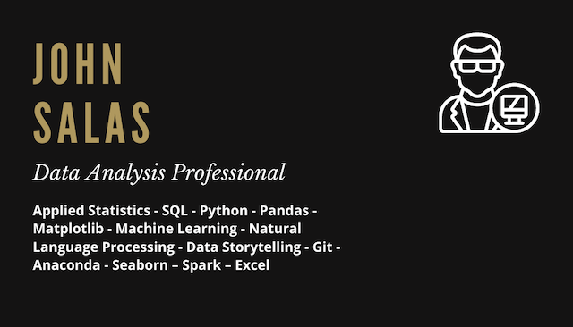

## Well met, friend 🤝

🔎 **Something to describe me:** I love analytics! Whether I’m looking for trends in data, pondering philosophical questions, or considering my play in a board or card game, I love breaking problems down and looking for the optimal solution.

🎲 **Fun fact:** I am a strategy gamer, and I love making games as much as I love playing them.

🏆 **Accomplishments:** I completed Codeup’s Data Science Career Accelerator and DataRobot’s 10X Applied Data Science Academy

⚒ **I am currently working on:** Space Commander, a resource management game written in Python

📓 **Upcoming Project:** Use NLP to sort Magic: The Gathering cards by color, using their rules text

💬 **Ask me about:** strategies for breaking down problems, strategy games, philosophy, or my latest new game idea.

